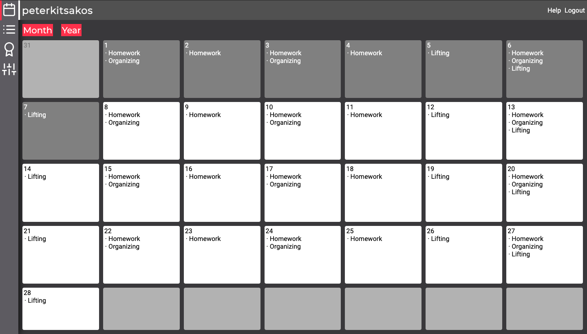
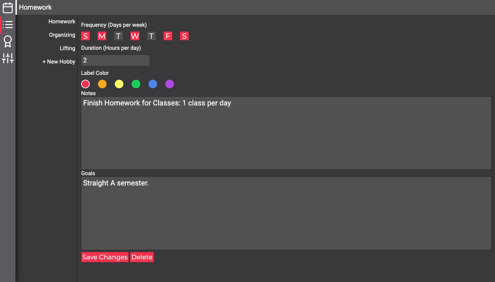

## Official Project Title
Progress Hobby Tracker
## Lead Developer
Peter Kitsakos
## Developer Social Media
* LinkedIn: https://www.linkedin.com/in/peter-kitsakos-6bb577188/
* GitHub: http://www.github.com/peterkitsakos
## Purpose
A Flask-Based web app design to help users schedule and track progress in hobbies, habits, and more.
## Interface:
 

